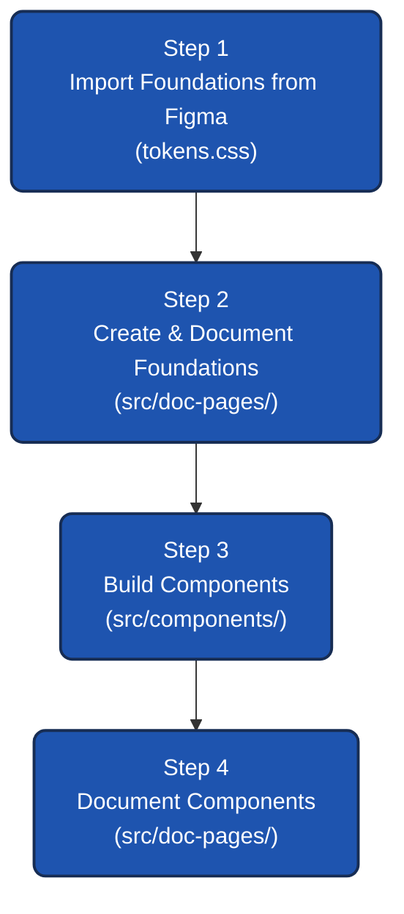

# CLAUDE.md

This file provides guidance to Claude Code (claude.ai/code) when working with code in this repository.

## Commands

- `npm run dev` — Start Vite dev server (http://localhost:5173)
- `npm run build` — Build production bundle to `dist/`
- `npm run lint` — Run ESLint on all JS/JSX files
- `npm run preview` — Preview production build locally

---

## Architecture

This is a React + Vite workspace containing the main application and the MCP Design System documentation site.

**Light mode only.** There is no dark mode. Do not add `prefers-color-scheme: dark` blocks anywhere.

### Routing & Folder Structure (React Router)

The project uses React Router with two main areas:
- **Main App (`/`)**: Pages live in `src/pages/` (e.g., `HomePage.jsx`).
- **Docs App (`/docs`)**: Design system documentation pages live in `src/doc-pages/` (e.g., `DocsApp.jsx`, `ButtonPage.jsx`).

### Design Token System

The authoritative source for all design tokens is `src/tokens.css`. We do NOT use JavaScript objects for tokens.
All variables are sourced directly from Figma variable exports in `src/variable-collections/`.

**Source of truth:** `src/variable-collections/*.tokens.json` — never invent token values.

### Brand Color

The brand is **mariner (blue)**. The following CSS vars are the accent system for the documentation site:

```css
--accent:        #1E54AF;   /* mariner-800 — active states, pills, icons */
--accent-hover:  #1E498A;   /* mariner-900 — hover */
--accent-light:  #3B9CF6;   /* mariner-500 — lighter variant */
--accent-bg:     #EFF8FF;   /* mariner-50  — tinted backgrounds */
--accent-border: #BFE4FE;   /* mariner-200 — subtle borders */
```

Do not use green (apple) as the primary brand color in doc-site UI.

### Styling Approach

- **Global Tokens:** `src/tokens.css` contains all design system CSS variables.
- **Documentation Styles:** `src/doc-pages/docs.css` contains shared utility classes for documenting components (e.g., `.doc-header`, `.doc-section`, `.doc-table`). Use these classes instead of inline styles for documentation pages.
- **Component Styles:** Design system components use CSS Modules (e.g., `button.module.css`).

In **design system components**, use the full semantic token names from `tokens.css`:
```css
var(--sds-color-background-brand-default)
var(--sds-color-text-default-default)
var(--spacing-pt-4)
```

---

## Development Workflow

Follow this systematic workflow when updating the design system. Do not skip steps.



### Step 1 — Import Foundations from Figma

1. Import variable collections from Figma (`src/variable-collections/`).
2. Convert the exported Figma variables into CSS variables within `src/tokens.css`.
3. Import icons from Figma into `src/icons/` as SVG React components.

### Step 2 — Create & Document Foundations

1. Ensure the foundation documentation pages (e.g., Colors, Typography, Spacing) in `src/doc-pages/` accurately reflect the variables in `tokens.css`.
2. Documentation pages must reference CSS variables directly, without hardcoded values in JS objects.

### Step 3 — Build Components (use `/figma-implement-design`)

1. Build React components in `src/components/<ComponentName>/` (e.g., `src/components/Button/Button.jsx`).
2. Fetch the Figma node using `get_design_context` (node ID + file key) and `get_screenshot` for visual validation.
3. Use CSS Modules (e.g., `button.module.css`) for component styling.
4. Use ONLY design tokens from `tokens.css` (`var(--sds-color-*)`, `var(--spacing-*)`, etc.) — no hardcoded hex or px values.
5. Validate the rendered output against the Figma screenshot.

### Step 4 — Document Components (use `/doc-coauthoring` & `/frontend-design`)

1. After the component is implemented, create/update its documentation page in `src/doc-pages/<ComponentName>Page.jsx`.
2. Use classes from `src/doc-pages/docs.css` (`.doc-header`, `.doc-section`, `.doc-table`) for layout.
3. The documentation MUST include:
   - **Header**: Eyebrow "Components", title, short description.
   - **Import**: CodeBlock showing how to import the component.
   - **Interactive Demo**: Live preview with variant/state controls.
   - **Basic Usage & Variants**: CodeSnippets and visual examples.
   - **Props Reference**: Table listing prop name, type, default, description.
   - **Accessibility & Focus**: Notes on token-driven focus management.

---

## Project Status

### ✅ Foundations — Documented (`src/doc-pages/`)

| Page | Route | File |
|---|---|---|
| Overview | `/docs/overview` | `OverviewPage.jsx` |
| Typography | `/docs/typography` | `TypographyPage.jsx` |
| Colors & Tokens | `/docs/colors` | `ColorsPage.jsx` |
| Spacing | `/docs/spacing` | `SpacingPage.jsx` |
| Corner Radius | `/docs/corner-radius` | `CornerRadiusPage.jsx` |
| Grids & Layouts | `/docs/grid` | `GridPage.jsx` |
| Elevation | `/docs/elevation` | `ElevationPage.jsx` |
| Icons | `/docs/icons` | `IconsPage.jsx` |

### 🔲 Components — In Progress (`src/doc-pages/`)

| Component | Route | Status |
|---|---|---|
| Button | `/docs/comp-button` | ✅ Done |
| Link | `/docs/comp-link` | Placeholder |
| Text Input | `/docs/comp-text-input` | Placeholder |
| Password | `/docs/comp-password` | Placeholder |
| Mobile Number | `/docs/comp-mobile-number` | Placeholder |
| Textarea | `/docs/comp-textarea` | Placeholder |
| Dropdown | `/docs/comp-dropdown` | Placeholder |
| Search | `/docs/comp-search` | Placeholder |
| Checkbox | `/docs/comp-checkbox` | Placeholder |
| Radio Button | `/docs/comp-radio-button` | Placeholder |
| Toggle Switch | `/docs/comp-toggle-switch` | Placeholder |
| Badge | `/docs/comp-badge` | Placeholder |
| Loader Indicators | `/docs/comp-loader` | Placeholder |
| Placeholder Logo | `/docs/comp-placeholder-logo` | Placeholder |

---

## Figma MCP Integration Rules

### Required Flow

1. Run `get_design_context` with node ID + file key
2. If truncated, run `get_metadata` to get node map, then re-fetch only needed nodes
3. Run `get_screenshot` for visual reference
4. Only after having both design context and screenshot, download assets and implement
5. Validate rendered UI against the Figma screenshot before marking complete

### Token Usage Rules

- NEVER hardcode hex color values or arbitrary px sizes.
- In design system components: use full SDS semantic tokens (`--sds-color-*`, `--spacing-*`).
- Elevation: use `var(--elevation-*)` and `--focus-shadow-*` CSS variables.

### Asset Rules

- Use localhost image/SVG sources returned by the Figma MCP server directly — do not re-download.
- SVG icons are imported as React components from `src/icons/`.
